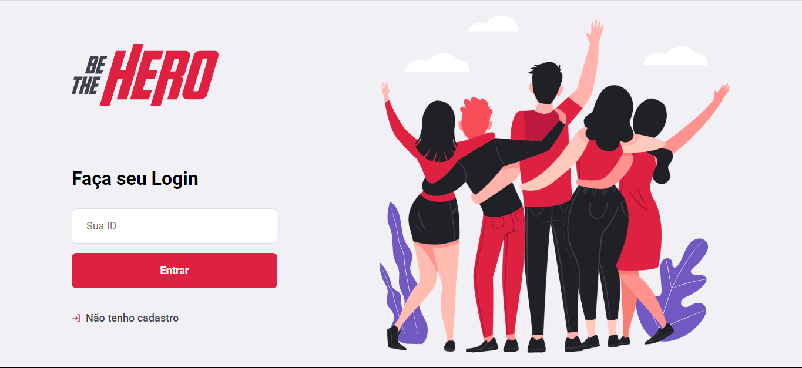
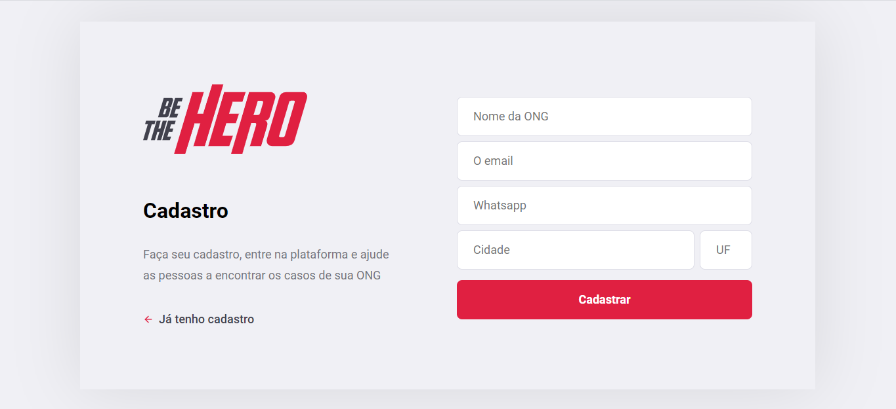
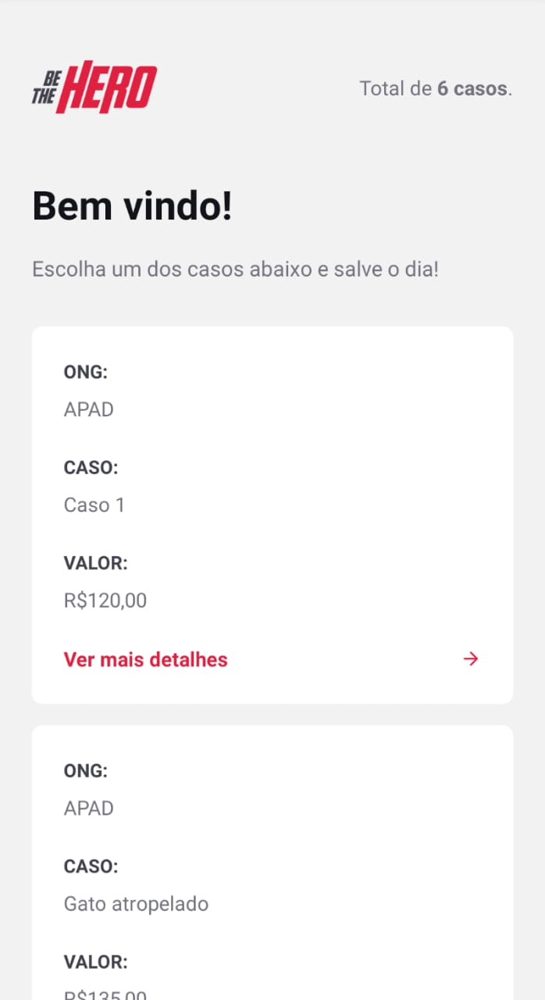
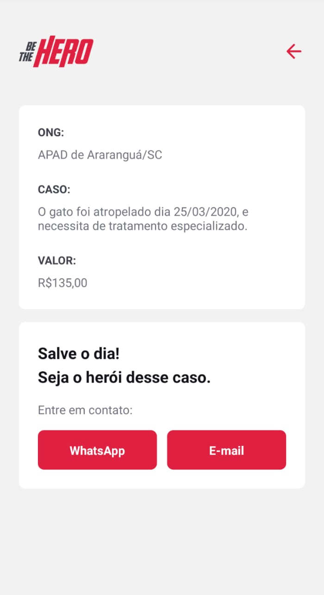

<h1 align="center">
    
</h1>

<h4 align="center"> 
	🚀 Semana OmniStack 11.0 
</h4>

  

  
	
  

  

  

  

## Índice

  <a href="#-tecnologias">Tecnologias</a>&nbsp;&nbsp;&nbsp;|&nbsp;&nbsp;&nbsp;
  <a href="#-projeto">Projeto</a>&nbsp;&nbsp;&nbsp;|&nbsp;&nbsp;&nbsp;
  <a href="#-necessita">Dependências</a>&nbsp;&nbsp;&nbsp;|&nbsp;&nbsp;&nbsp;
  <a href="#-layout">Layout</a>&nbsp;&nbsp;&nbsp;|&nbsp;&nbsp;&nbsp;
  <a href="#-conceitos">Lições Aprendidas</a>&nbsp;&nbsp;&nbsp;|&nbsp;&nbsp;&nbsp;
  <a href="#-contato">Entre em Contato</a>&nbsp;&nbsp;&nbsp;|&nbsp;&nbsp;&nbsp;
  <a href="#memo-license">License</a>

 

## 🔧 Tecnologias

Este projeto foi desenvolvido com as seguintes tecnologias:

- [Node.js](https://nodejs.org/en/) 
- [React](https://reactjs.org)
- [ReactJS](https://reactjs.org/)
- [React Native](https://facebook.github.io/react-native/)
- [Expo](https://expo.io/)
- [Express](https://expressjs.com/pt-br/)
- [SQLite](https://www.sqlite.org/index.html)
- [Sequelize](https://sequelize.org/)
- [Nodemon](https://nodemon.io/)
- [Sucrase](https://github.com/alangpierce/sucrase)
- [React Router DOM](https://reacttraining.com/react-router/)
- [React Navigation](https://reactnavigation.org/)
- [React Icons](https://react-icons.netlify.com/#/)
- [UnForm](https://unform.dev/) [💜](https://rocketseat.com.br/)
- [Styled Components](https://styled-components.com/)
- [Axios](https://github.com/axios/axios)
- [Eslint](https://eslint.org/)
- [Prettier](https://prettier.io/)
- [EditorConfig](https://editorconfig.org/)

**[⬆ voltar ao topo](#Índice)**

## 🔧 Necessita

### Ferramentas

- Chocolatey
- NodeJS LTS
- React
- React Native
- Insomnia

### Dependências

Em backend:
- express
- nodemon
- knex
- sqlite3
- crypto
- cors

Em frontend:
- react
- react-dom
- react-icons (Feather Icons)
- react-scripts
- react-router-dom
- axios (Cliente HTTP)

## 💻 Projeto

Be The Hero é um projeto que visa conectar pessoas dispostas a ajudar ONGs.

Com essa aplicação as ONGs podem informar sobre seus casos, necessidades e o valor necessário para solucionar o problema.

A partir dessas informações toda a sociedade pode contruibir com um determinado caso e ser o herói de dia para aquela ONG.

É visado por meio da interação entre ONG e comunidade: A ampliação da área de atuação da ONG, o aumento da velocidade e eficácia na resolução dos problemas.

<h1 align="center">
    
</h1>

## 📌 Conceitos

### Aula 02

#### Rotas e Recursos

> Rotas : É o endereço completo da url inclusive o recurso.

> Recurso: É o final da URL representando provalvemente uma entidade da aplicação. Ex: /users

#### Métodos HTTP

> Método GET: Buscar uma informação no Back-End

> Método POST: Criar uma informação no Back-End

> Método PUT: Alterar uma informação no Back-End

> Método DELETE: Deletar uma informação no Back-End

#### Tipos de Parâmetros

> Query Params: Parâmetros nomeados enviados na rota, após o simbolo de "?" e geramente servem para filtro, paginação.

> Route Params: Parâmetros utilizados para identificar recursos.

> Request Body: Corpo da requisição utilizado para criar ou alterar dados em recursos.

#### Bancos de Dados

> Banco de Dados Relacional : MySQL, SQLite, PostgreSQL, Oracle, Microsoft SQL Server, estes prezam a estrutura e a organização dos dados. Usam a linguagem SQL.

> Banco de Dados Não Relacional : MongoDB, CouchDB, etc... Servem mais como forma de armazenamento sem se preocupar muito com organização e relacionamentos. Linguagem unica para cada DB.

> Formas de comunicação com banco de dados: Por Driver ou por Query Builder. 

> Ferramenta para comunicação com o banco de dados utilizada: Knex, web site de ferência [Knex](http://knexjs.org/)

> Entidades da nossa aplicação : ONG, Caso (Incident)

> Funcionalidades : Login de ONG, Logout ONG, Cadastro de ONG, Cadastrar novo Caso, Deletar Casos. Listar Casos especificos de uma ONG, Listar todos dos Casos, Entrar em contato com a ONG.

### Aula 03

> Componente : Um Componente é uma função que retorna HTML. 

> JSX: É o nome dado para a mistura de JavaScript com HTML.

> Propriedades no React : São "atributos" passados para componentes dentro do React. 

> Estado no React: Informação que será mantida pelo componente, gerenciada pelo componente e essas informações são refletidas na interface.

> Imutabilidade: Por uma questão de performace, o valor de estados não podem ser alterados de forma direta, eles precisam ser sobrepostos.

### Aula 04

#### Conceitos aprendidos

> Expo : Framework para unificar o desenvolvimento mobile, eliminando a preocupação de compilação para várias plataformas (Android, IOS).

> Elementos React Native, Diferenças : Não possuem diferenças significativas quanto ao aspecto semântico. A estilização é feita por meio de objetos StyleSheet que é renderizada pela classe StyleSheet do React-Native. Propriedades de estilo são em CamelCase. Não possuie Herança de Estilo, todo componente deve ser estilizado de maneira individual.

> Deep Link: Maneira nativa de chamar uma aplicação dentro de um SO Mobile.

### Aula 05

#### Conceitos aprendidos

> Validações com Celebrate: Celebrate é uma biblioteca JavaScript para validação, que é uma facitora da implementação do Joi. No códgio, você adiciona nas rotas logo após o endereço da rota as validações, e o Express por funcionar no estilo Medware irá executar a sequencia Rota, Validação, Ação... por isso é importante fazer a validação antes da ação. As validações do Joi apresentam um padrão, que se resume a Joi (TIPO.OBRIGATORIEDADE.DETALHES_CAMPO). O Celebrate já tem uma biblioteca padrão de personalização de erro, e é muito simples, basta no index.js fazer o use de erros, da biblioteca do Celebrate. O Celebrate permite você validar todos os campos por tipo em uma mesma requisição, juntos, Header, Body, Query etc...

> Teste automátizados com Jest : Framework para desenvolvimento de testes no Node, React e até ReactNative. Para usar necessário começar fazendo um npx jest --init. Os 2 mais importantes testes seriam os unitários (unit) e os de integração (integration).

> Teste de Integração : Esse tipo de Teste toca varias parte da aplicação, testando por completo uma funcionalidade.

> Teste Unitário : Esse tipo de Teste encosta em um setor muito isolado da aplicação tem por objetivo testar uma unidade bem finita de código. Alto muito expecifico.

> Biblioteca cross-env : Usada para diferenciar os ambientes por meio do package.json.

> Biblioteca supertest : Biblioteca com ferramentas para teste, entre elas um "CHAMADOR" de API, ou seja requisições HTTP.

> NOTAS: Seria interessante usar o jest e supertest como dependências de desenvolvimento. Usando o -D na hora da instalação.

## 🔖 Layout

**Web**

 

 

**Mobile**

 

 

## 💬 Contato
------------------
Obrigado por chegar até aqui! 

[*Entre em contato comigo*](https://www.linkedin.com/in/cicerocruz/)

## :memo: License

Este projeto está sob a licença MIT. 
