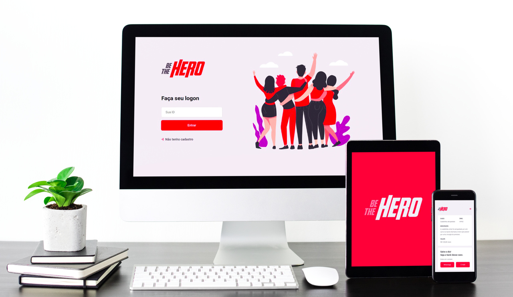

<h1 align="center">
    
</h1>

<h4 align="center"> 
	:construction: 🚀 Semana OmniStack 11.0 ( In progress.. ) :construction:
</h4>

  

  
	
  

  

  

  

  <a href="#CRUZ-Tecnologias">Tecnologias</a>&nbsp;&nbsp;&nbsp;|&nbsp;&nbsp;&nbsp;
  <a href="#-project">Projeto</a>&nbsp;&nbsp;&nbsp;|&nbsp;&nbsp;&nbsp;
  <a href="#-layout">Layout</a>&nbsp;&nbsp;&nbsp;|&nbsp;&nbsp;&nbsp;
  <a href="#memo-license">License</a>

 

## :CRUZ:Tecnologias

Este projeto foi desenvolvido com as seguintes tecnologias:

- [Node.js](https://nodejs.org/en/) 
- [React](https://reactjs.org)
- [React Native](https://facebook.github.io/react-native/)
- [Expo](https://expo.io/)

## 💻 Projeto

Be The Hero é um projeto que visa conectar pessoas dispostas a ajudar ONGs.

<h1 align="center">
    
</h1>

## 🔖 Layout

:construction: Em Progresso.. :construction:

## :memo: License

Este projeto está sob a licença MIT. 
